# 综合实验报告

| 项目 | 内容 |
|------|------|
| **课程名** | 软件系统分析与设计技术综合实验 |
| **课题题目** | 校园网上选课系统 |
| **班级** |  |
| **组员学号** |  |
| **组员姓名** |  |
| **指导教师** |  |
| **报告完成日期** |  |

---

## 期末报告评分标准

| 评分项 | 评分标准 | 分值 | 实际得分 |
|--------|----------|------|----------|
| 项目启动及系统概述 | 能查阅资料，分析现有系统存在的问题，找出课题开发的目的和意义，界定课题范围和目标，完成团队的合理分工。确定系统的初步技术路线，完成可行性分析，使用图、表完成开发计划。 | 10 | |
| 需求分析 | 能选用适当的方法对课题进行需求分析，如业务流程图、数据流图、功能点、用例模型等，涵盖系统的功能需求和非功能需求。需求规格合理、完整，有一定的难点功能或新功能，表述清晰，图文并茂，论述具体透彻，格式规范。 | 30 | |
| 概要设计 | 能充分考虑课题特点与适用技术完成总体设计，如功能模块设计、系统架构设计、系统流程设计、类结构设计、数据库设计等。设计方案合理，有一定的新技术应用，表述清晰，论述具体透彻，格式规范。 | 20 | |
| 详细设计 | 能在需求分析和概要设计的基础上，针对核心功能模块或组件、类的方法或类间的协作、重要算法进行详细设计。设计能覆盖功能需求和非功能需求，表述清晰，论述具体透彻，格式规范。 | 15 | |
| 系统实现 | 能根据系统需求和设计方案，实现课题系统或有一定规模的特定课题子系统，有一定的新技术应用，主要实现过程、结果完整。 | 15 | |
| 系统测试 | 能够根据系统需求，制定测试计划，撰写测试用例，并完成测试，列出不符合项，测试报告完整。 | 10 | |
| **合计** | | **100** | |

---

## 目  录

- 第一章 项目启动及系统概述
  - 1.1 项目背景
  - 1.2 现有系统存在的问题
  - 1.3 项目的目的及意义
  - 1.4 项目的范围
  - 1.5 项目的预期目标
  - 1.6 可行性分析
- 第二章 需求分析
  - 2.1 目标系统描述
  - 2.2 目标系统功能需求
  - 2.3 目标系统性能需求
  - 2.4 目标系统界面需求
  - 2.5 目标系统其他需求
  - 2.6 目标系统假设与约束条件
- 第三章 概要设计
  - 3.1 总体设计
  - 3.2 接口设计
  - 3.3 数据库设计
  - 3.4 设计检查列表
- 第四章 详细设计
  - 4.1 模块/组件/算法详细设计
  - 4.2 接口实现设计
- 第五章 系统实现
  - 5.1 开发环境
  - 5.2 系统程序结构
  - 5.3 系统模块
  - 5.4 程序文件一览表
- 第六章 系统测试
  - 6.1 测试环境要求
  - 6.2 测试计划
  - 6.3 功能测试报告
  - 6.4 测试结论
- 第七章 总结与展望
  - 7.1 团队分工与完成情况
  - 7.2 团队组织协调解决的问题情况与总结
  - 7.3 项目总结
  - 7.4 收获与未来展望
- 参考文献

---

## 第一章 项目启动及系统概述

### 1.1 项目背景

随着高校规模的不断扩大和学生数量的增加，高校教务管理面临着越来越多的挑战。传统的选课方式存在诸多问题：学生需要在规定时间内集中选课，系统并发压力大；课程信息分散在各个院系，缺乏统一展示平台；学生在选课时难以快速了解课程详情、上课时间、先修要求等关键信息；教务管理人员缺乏高效的课程管理和选课数据统计工具。

近年来，Web 开发技术得到了快速发展和普及，基于 Python Flask 框架的 Web 应用因其轻量、灵活、易于扩展的特点，成为了构建中小型教务系统的理想选择。利用 Flask 全栈开发技术构建校园网上选课系统，能够为学生提供便捷的课程浏览、智能冲突检测和一键选课体验，为教务管理员提供高效的课程管理、学生管理和数据统计功能。

高校作为信息化建设的先行者，一直致力于推动校园信息化进程。校园网上选课系统作为教务信息化建设的重要组成部分，不仅可以提升选课效率和体验，还可以为后续的教学数据分析、培养方案优化提供数据支撑。

### 1.2 现有系统存在的问题

首先，传统的选课系统多为早期的 C/S 架构或老旧的 B/S 架构，界面不够友好，响应速度慢，尤其在选课高峰期容易出现系统崩溃的情况。其次，大多数选课系统缺乏智能的时间冲突检测功能，学生需要手动比对课表，容易出现选课时间冲突的问题。再者，课程信息展示不够直观，学生难以快速获取课程的核心信息（如学分、教师、上课时间地点、剩余名额等）。部分系统的管理员后台功能薄弱，缺乏批量导入课程、分类管理等便捷操作，增加了教务人员的工作负担。此外，一些选课系统的安全性不足，存在 SQL 注入、XSS 攻击和 CSRF 攻击的风险，学生信息和选课数据的安全性得不到充分保障。

### 1.3 项目的目的及意义

系统开发的意义在于解决高校选课过程中存在的问题，提升学生的选课体验和教务管理的效率，推动校园教务信息化建设。通过构建一个功能完善、界面友好、安全可靠的校园网上选课系统，可以为学生提供便捷的课程浏览与检索、智能的时间冲突检测、一键选课/退课操作以及可视化的课程表展示；为管理员提供课程增删改查、课程分类管理、学生信息管理、选课记录查看与统计以及 Excel 批量导入课程等功能。

系统开发的目的在于利用 Flask Web 框架和相关技术栈，为高校学生和教务管理员提供一个高效的选课管理平台。通过该系统，学生可以方便地浏览课程、查看课程详情、选课退课和查看个人课表；管理员可以高效管理课程数据、学生数据和选课数据，并支持批量导入导出操作。

### 1.4 项目的范围

#### （1）基本功能要求

校园网上选课系统包含以下几个主要部分：

**学生端**：提供课程浏览与搜索、课程详情查看、选课/退课操作、个人课表查看、已选课程管理等功能。学生端采用响应式 Web 设计，确保在桌面和移动设备上均有良好的使用体验。

**管理员端（后台管理系统）**：提供课程管理（CRUD）、课程分类管理、学生管理、选课记录查看与统计、Excel 批量导入课程、管理员密码修改等功能。管理员端为独立的后台界面，仅对管理员角色开放。

#### （2）系统的主要输入、输出要求

**主要输入**：
- 用户注册信息：用户名、邮箱、密码等
- 课程信息：课程名称、课程编号、授课教师、学分、容量、学期、上课时间安排、上课地点、课程描述、课程分类等
- 选课操作：学生选择或退选课程的请求
- Excel 批量导入文件：包含多门课程信息的 .xlsx 文件

**主要输出**：
- 用户信息反馈：注册成功/失败、登录成功/失败提示
- 课程列表展示：按学期、分类、关键词筛选的课程列表
- 课程详情：课程完整信息及选课状态
- 选课结果：选课成功/失败提示（含名额已满、时间冲突等）
- 个人课程表：以可视化表格展示一周课程安排
- 管理统计数据：学生数、课程数、选课记录数等

#### （3）主要性能要求及相应的指标

- **响应时间**：系统响应时间应不超过 3 秒
- **并发用户数**：系统应支持至少 200 名学生同时在线选课
- **数据存储**：支持至少万级别的课程和选课数据量
- **系统可用性**：系统可用性应达到 99% 以上

#### （4）完成日期要求

- 项目启动时间：2026年7月20日
- 系统需求分析和设计：2026年7月22日完成
- 系统概要设计：2026年7月24日完成
- 系统详细设计：2026年7月25日完成
- 系统编码实现：2026年7月27日完成
- 系统软件测试：2026年7月29日完成

### 1.5 项目的预期目标

校园网上选课系统的开发旨在实现以下几个主要目标：

（1）**提供便捷的选课服务**：系统需要为学生提供一个简洁直观的界面，让他们可以方便地浏览课程、搜索课程、查看课程详情，并一键完成选课或退课操作。

（2）**智能冲突检测**：系统在选课时自动检测时间冲突，避免学生选择时间重叠的课程，确保课表的合理性。

（3）**可视化的课程表展示**：以表格形式直观展示学生一周的课程安排，不同课程以不同颜色区分。

（4）**高效的课程管理**：管理员可以通过后台系统高效地进行课程增删改查、分类管理和 Excel 批量导入，大大提升工作效率。

（5）**保障信息安全**：系统实施基于角色的访问控制（RBAC），对用户密码进行哈希加密存储，并防范 SQL 注入、XSS 和 CSRF 等常见 Web 安全攻击。

### 1.6 可行性分析

#### 1）技术可行性分析

随着 Python Web 开发技术的成熟，Flask 框架及其生态系统（Flask-Login、Flask-SQLAlchemy、Flask-WTF、Flask-Migrate 等）已经非常完善，可以快速构建一个功能齐全、安全可靠的 Web 应用。SQLite 数据库在开发和小规模部署场景下完全满足需求，且可通过 Flask-Migrate 方便地迁移到 MySQL 或 PostgreSQL。前端采用 Jinja2 模板引擎 + 原生 CSS/JavaScript，无需依赖复杂的前端框架，开发效率高且易于维护。综上，技术方案完全可行。

#### 2）经济可行性分析

系统采用完全开源的技术栈（Python、Flask、SQLite），无需支付任何软件许可费用。开发工具使用 VS Code（免费），部署可使用学校现有的服务器资源或低成本的云服务器。系统开发和维护成本较低，经济效益显著。

#### 3）社会可行性分析

校园网上选课系统的开发符合高校信息化建设的发展趋势，是提升教务管理水平的重要举措。系统可以为学生提供更便捷的选课体验，为教务管理员提供更高效的管理工具，促进校园信息化服务的整合与发展。

#### 4）运行可行性分析

系统采用 B/S 架构，用户只需浏览器即可访问，无需安装客户端软件。系统界面设计简洁直观，操作流程清晰，用户上手容易。管理员通过后台管理系统即可完成所有管理操作，降低了培训成本。

#### 5）项目风险评估及结论意见

**项目风险评估**：技术选型不当可能导致开发效率低下；需求变更可能导致项目范围膨胀；安全漏洞可能导致数据泄露。

**结论意见**：采用成熟的 Flask 技术栈可以有效降低技术风险；在项目初期明确需求范围，控制需求变更；在设计和开发全程贯彻安全最佳实践，如 CSRF 防护、密码哈希、输入验证等。项目开发过程中持续进行测试，确保产品质量和稳定性。

---

## 第二章 需求分析

### 2.1 目标系统描述

#### 2.1.1 组织结构与职责

网上选课系统涉及的主要角色及其职责如下：

**表2-1 网上选课系统角色描述**

| 角色 | 职责 | 相关业务 |
|------|------|----------|
| 学生（Student） | 浏览课程列表、搜索与筛选课程、查看课程详情、选课/退课、查看个人课表、查看已选课程 | 课程浏览、选课操作、课表查看 |
| 管理员（Admin） | 管理课程信息（增删改查）、管理课程分类、管理学生信息、查看选课记录与统计、Excel 批量导入课程、修改管理员密码 | 课程管理、学生管理、数据统计 |

#### 2.1.2 业务流程

**（1）学生选课流程图**

学生首先进入系统，如果未登录则跳转到登录页面，没有账号则注册新账号。登录成功后，学生进入课程列表页面，可以按学期、分类、关键词进行筛选和搜索。学生点击课程可查看课程详情，包括上课时间、教师、学分、剩余名额等信息。学生选择课程时，系统自动检测时间冲突和名额状态：若无冲突且有名额，则选课成功；若有时间冲突，提示无法选课；若名额已满，提示课程已满。学生可以在"我的选课"页面查看已选课程，并进行退课操作。学生还可以查看可视化的个人课程表。

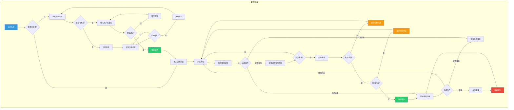

**图2-1 学生选课业务流程图**

**（2）管理员操作流程图**

管理员登录后进入管理后台首页，可以看到系统概览统计数据（学生总数、课程总数、选课记录数）。管理员可以进行课程管理（新建课程、编辑课程、查看课程详情、删除课程）、课程分类管理（添加分类、编辑分类、删除分类）、学生管理（查看学生列表、查看学生选课详情、编辑学生信息）、选课记录管理（查看所有选课记录、按多种条件筛选）。管理员还可以通过 Excel 文件批量导入课程数据，以及修改自己的登录密码。

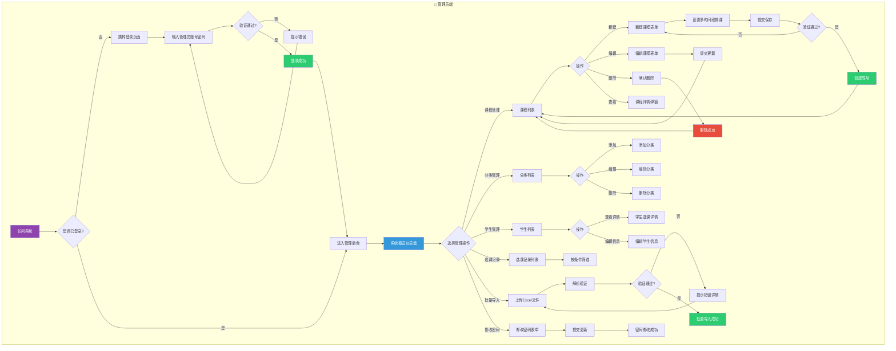

**图2-2 管理员操作流程图**

#### 2.1.3 数据流图及数据字典

**（1）数据流图**

- **0层图（上下文图）**：学生将其选课请求发送给选课系统，选课系统将课程信息、选课结果返回给学生；管理员可以对选课系统进行管理操作。

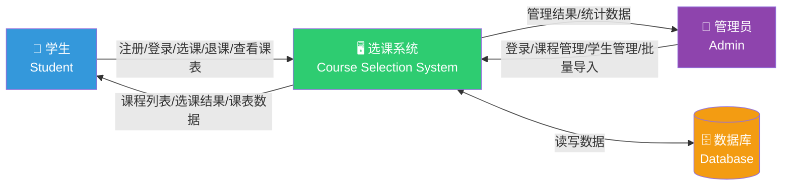

**图2-3 数据流图0层图**

- **1层图（功能分解）**：
  - 学生功能：课程浏览、课程搜索、课程详情、选课操作、退课操作、课表查看、个人中心
  - 管理员功能：课程管理、分类管理、学生管理、选课记录管理、批量导入、系统概览

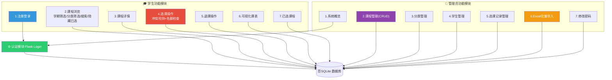

**图2-4 数据流图1层图**

**（2）数据字典**

**用户表（users）**：用于存储系统的用户信息，包括用户名、邮箱、密码哈希、角色和创建时间。
- 组成：用户表 = 用户ID + 用户名 + 邮箱 + 密码哈希 + 角色（student/admin）+ 创建时间

**课程表（courses）**：用于存储课程的基本信息。
- 组成：课程表 = 课程ID + 课程名称 + 课程编号 + 课程描述 + 授课教师 + 学分 + 容量 + 已选人数 + 学期 + 分类ID + 上课地点 + 创建时间

**课程分类表（course_categories）**：用于存储课程分类信息。
- 组成：课程分类表 = 分类ID + 分类名称 + 显示顺序 + 创建时间

**课程时间安排表（course_schedules）**：用于存储每门课程的具体上课时间安排。
- 组成：课程时间安排表 = 时间安排ID + 课程ID + 星期几(0-6) + 开始时间 + 结束时间

**选课记录表（selections）**：用于存储学生的选课记录。
- 组成：选课记录表 = 选课ID + 学生ID + 课程ID + 状态(enrolled/dropped) + 选课时间

### 2.2 目标系统功能需求

#### 2.2.1 用例图

**1、学生用例**

（1）学生用例的参与者：学生（Student）

（2）学生用例的用例及用例间关系：
- 注册登录：注册账号、登录系统、退出登录
- 课程浏览：查看课程列表、按学期筛选、按分类筛选、按关键词搜索、隐藏已选课程
- 课程详情：查看课程信息（名称、编号、教师、学分、容量、时间、地点、描述）
- 选课操作：选课（自动冲突检测和名额检查）、退课
- 课表管理：查看可视化的个人课程表（按星期+时间段排列）
- 已选课程：查看已选课程列表

（4）学生用例图如图2-5所示。

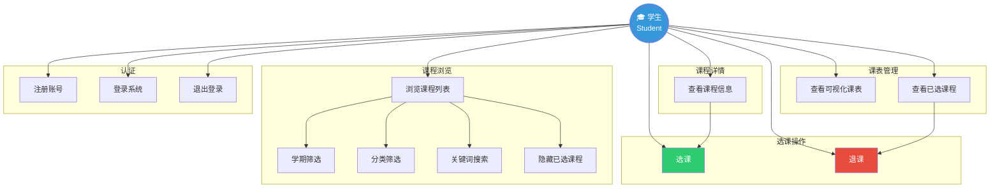

**图2-5 学生用例图**

**2、管理员用例**

（1）管理员用例的参与者：管理员（Admin）

（2）管理员用例的用例及用例间关系：
- 登录：管理员登录系统
- 系统概览：查看学生总数、课程总数、选课记录数统计
- 课程管理：新建课程、编辑课程、查看课程详情、删除课程
- 分类管理：添加课程分类、编辑课程分类、删除课程分类
- 学生管理：查看学生列表、查看学生选课详情、编辑学生信息
- 选课管理：查看所有选课记录、按条件筛选
- 批量导入：Excel 文件批量导入课程
- 密码修改：修改管理员密码

（4）管理员用例图如图2-6所示。

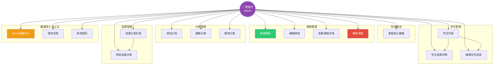

**图2-6 管理员用例图**

#### 2.2.2 关键用例描述

**表2-2 学生用例描述**

| 标题 | 内容 |
|------|------|
| 用例名称 | 学生选课 |
| 用例描述 | 此用例描述了学生在网上选课系统上的主要功能 |
| 参与者 | 学生 |
| 前置条件 | 学生必须在系统中注册有有效账户，系统必须处于可操作和可访问状态 |
| 基本流程 | 1. 注册登录；2. 浏览课程列表（支持学期筛选、分类筛选、关键词搜索）；3. 查看课程详情；4. 选课（自动检测时间冲突和名额）；5. 查看已选课程；6. 退课操作；7. 查看可视化个人课程表 |
| 备选流程 | 如果输入的用户名或密码与数据库中存储的不匹配，系统提示用户重新输入或显示登录失败消息 |
| 后置条件 | 学生成功登录系统，可以开始执行其在系统中的操作任务 |

**表2-3 管理员用例描述**

| 标题 | 内容 |
|------|------|
| 用例名称 | 教务管理 |
| 用例描述 | 此用例描述了管理员在网上选课系统上的主要功能 |
| 参与者 | 管理员 |
| 前置条件 | 管理员必须在系统中注册有有效账户且角色为 admin |
| 基本流程 | 1. 登录系统；2. 查看系统概览统计；3. 课程管理（增删改查）；4. 课程分类管理；5. 学生信息管理；6. 选课记录管理；7. Excel 批量导入课程；8. 修改密码 |
| 备选流程 | 如果输入的用户名或密码错误，系统提示重新输入 |
| 后置条件 | 管理员成功登录系统，可以开始执行管理操作 |

### 2.3 目标系统性能需求

**表2-4 性能需求点列表**

| 编号 | 性能名称 | 使用角色 | 性能描述 | 输入内容 | 输出内容 |
|------|----------|----------|----------|----------|----------|
| 1 | 响应时间 | 学生 | 系统对用户操作的响应时间应小于 3 秒 | 用户点击或提交的操作请求 | 操作结果的反馈页面或信息 |
| 2 | 并行处理能力 | 学生 | 系统应能同时处理至少 200 个并发请求 | 多用户同时发出的选课请求 | 每个用户的选课成功/失败提示 |
| 3 | 数据完整性 | 管理员 | 选课数据应保持一致性，避免超卖 | 选课操作请求 | 准确的选课结果和名额更新 |

### 2.4 目标系统界面需求

#### 2.4.1 界面需求

界面的原则要求：方便、简洁、美观、一致。整个系统采用统一的导航栏和配色风格，不同功能模块遵循相似的操作逻辑。

- **输入设备**：键盘、鼠标
- **输出设备**：显示器
- **显示风格**：Web 图形界面，响应式设计
- **显示方式**：适配 1024×768 及以上分辨率，支持移动端访问

### 2.5 目标系统其他需求

#### 2.5.1 安全性

（1）**密码加密**：使用 Werkzeug 提供的 bcrypt 算法对用户密码进行哈希加密存储，不保存明文密码。

（2）**用户身份验证**：使用 Flask-Login 实现基于 Session+Cookie 的用户会话管理。

（3）**访问控制**：基于角色的访问控制系统（RBAC），区分学生（student）和管理员（admin）两种角色，确保只有授权用户才能访问特定功能和数据。管理员路由使用 `admin_required` 装饰器进行权限校验。

（4）**CSRF 防护**：使用 Flask-WTF 的 CSRFProtect 为所有表单提供 CSRF 令牌保护，防止跨站请求伪造攻击。

（5）**输入验证**：对所有用户输入进行服务端验证（WTForms 验证器），防止空值、超长输入和格式错误。

（6）**XSS 防护**：Jinja2 模板引擎默认对输出进行 HTML 转义，防止跨站脚本攻击。

#### 2.5.2 可靠性

（1）**数据一致性**：选课操作使用数据库事务确保名额更新和选课记录创建/更新的原子性。选课时进行双重检查（名额检查 + 时间冲突检查）。

（2）**错误处理**：关键操作有完善的异常处理机制，用户操作失败时提供清晰的错误提示信息。

（3）**数据完整性**：通过数据库唯一约束（如用户名、邮箱、学号与课程编号唯一）和外键约束确保数据完整性。

#### 2.5.3 灵活性

（1）**模块化设计**：系统采用 Flask Blueprint 进行模块化组织（auth、course、admin、main 四个蓝图），方便后续功能扩展和维护。

（2）**可配置性**：通过配置类（Config / TestingConfig）管理不同环境的配置参数，支持环境变量覆盖。

（3）**App Factory 模式**：使用 Flask 应用工厂模式（create_app），支持创建不同配置的应用实例，便于测试和多环境部署。

（4）**数据库迁移**：集成 Flask-Migrate（Alembic），支持数据库 schema 的版本化管理和迁移。

#### 2.5.4 特殊需求

（1）**课程表可视化**：以表格形式展示学生一周课程安排，不同课程使用不同颜色标识，一目了然。

（2）**批量导入**：管理员可通过 Excel 文件批量导入课程数据，支持 .xlsx 格式，自动校验数据格式。

（3）**自动冲突检测**：选课时自动检测时间冲突并阻止选课，避免学生课程时间重叠。

### 2.6 目标系统假设与约束条件

（1）**数据安全风险**：系统可能面临 Web 安全威胁，如 SQL 注入、CSRF、XSS 攻击等。需在开发全程贯彻安全最佳实践，使用 ORM 防止 SQL 注入，使用 CSRF 令牌和输出转义。

（2）**系统可用性风险**：SQLite 数据库在并发写入场景下性能有限，适合中小规模部署。如需大规模部署，可迁移至 MySQL 或 PostgreSQL。

（3）**性能瓶颈**：在选课高峰期，大量学生同时操作可能导致数据库写入竞争。可通过连接池优化、数据库升级等方式缓解。

---

## 第三章 概要设计

### 3.1 总体设计

#### 3.1.1 总体结构设计

系统采用经典的 MVC（Model-View-Controller）架构模式：

- **Model 层**：使用 SQLAlchemy ORM 定义数据模型（User、Course、CourseCategory、CourseSchedule、Selection），负责数据持久化和业务逻辑。
- **View 层**：使用 Jinja2 模板引擎渲染 HTML 页面，呈现用户界面。
- **Controller 层**：使用 Flask Blueprint 组织路由和处理请求，协调 Model 和 View。

系统整体采用 Flask App Factory 模式，通过 `create_app()` 工厂函数创建应用实例，便于测试和多环境配置。

**系统层级结构**：

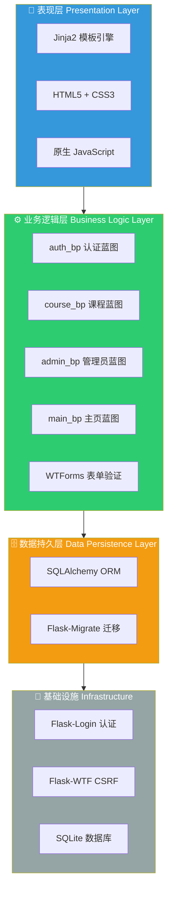

**图3-1 系统层级架构图**

- 表现层：Jinja2 模板 + HTML/CSS + 原生 JavaScript
- 业务逻辑层：Flask 路由 + WTForms 表单验证 + SQLAlchemy 模型方法
- 数据持久层：SQLAlchemy ORM + SQLite 数据库
- 基础设施：Flask 扩展（Flask-Login、Flask-Migrate、Flask-WTF）

**系统功能模块结构**：

```
校园网上选课系统
├── 学生端
│   ├── 课程浏览与搜索
│   │   ├── 课程列表（分页）
│   │   ├── 学期筛选
│   │   ├── 分类筛选
│   │   ├── 关键词搜索
│   │   └── 隐藏已选课程
│   ├── 课程详情
│   │   └── 课程信息弹窗（名称/编号/教师/学分/时间/地点/描述/名额）
│   ├── 选课操作
│   │   ├── 选课（含冲突检测+名额检查）
│   │   └── 退课
│   ├── 个人课表
│   │   └── 可视化周课表（颜色区分）
│   └── 已选课程
│       └── 已选课程列表
└── 管理员端
    ├── 系统概览
    │   └── 统计数据（学生数/课程数/选课数）
    ├── 课程管理
    │   ├── 课程列表（分页+搜索）
    │   ├── 新建课程（多时间段排课）
    │   ├── 编辑课程
    │   ├── 课程详情查看
    │   └── 删除课程
    ├── 分类管理
    │   ├── 添加分类
    │   ├── 编辑分类
    │   └── 删除分类
    ├── 学生管理
    │   ├── 学生列表
    │   ├── 学生选课详情
    │   └── 编辑学生信息
    ├── 选课记录管理
    │   └── 选课记录列表（支持筛选）
    ├── 批量导入
    │   └── Excel 文件批量导入课程
    └── 密码修改
```

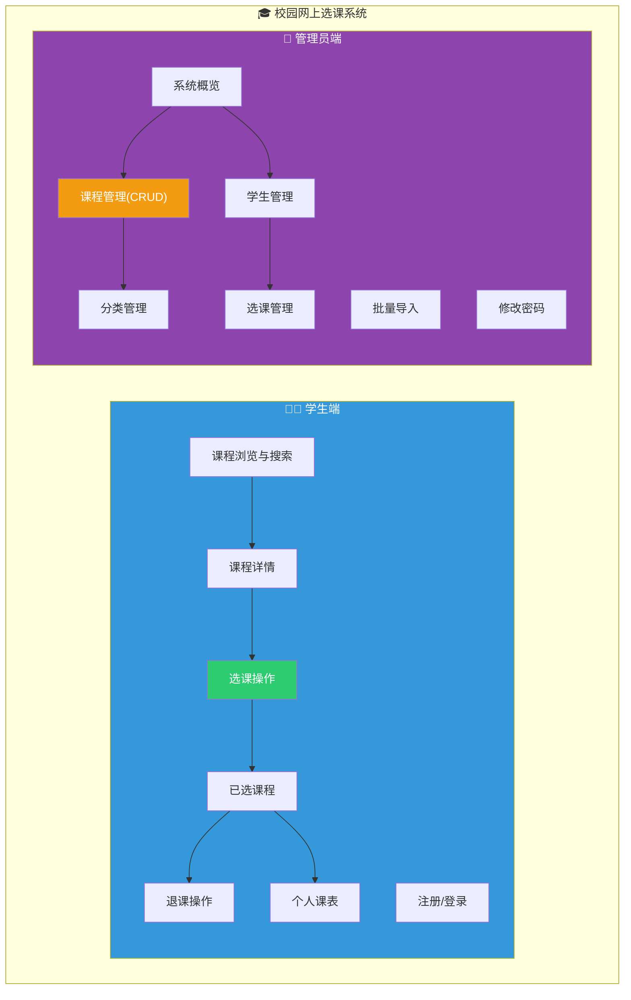

**图3-2 系统功能模块图**

#### 3.1.2 子系统清单

**表3-1 子系统清单**

| 子系统编号 | 子系统英文名 | 子系统功能简述 | 子系统之间的关系 |
|------------|-------------|---------------|-----------------|
| SS1 | Auth Management | 管理用户的注册、登录和身份验证过程 | 与其他所有子系统交互，提供用户认证和授权 |
| SS2 | Course Browse & Search | 课程列表展示、多条件搜索与筛选 | 与选课子系统交互获取选课状态 |
| SS3 | Course Detail | 展示课程详细信息 | 与选课子系统交互获取选课状态 |
| SS4 | Enrollment Management | 处理选课和退课操作，含冲突检测和名额检查 | 与课程子系统、课表子系统交互 |
| SS5 | Timetable Management | 可视化展示学生个人周课表 | 与选课子系统交互获取已选课程 |
| SS6 | Admin Dashboard | 系统概览统计 | 汇总其他子系统数据 |
| SS7 | Course CRUD Management | 课程信息增删改查 | 与分类管理子系统交互 |
| SS8 | Category Management | 课程分类增删改查 | 为课程管理提供分类数据 |
| SS9 | Student Management | 学生信息查看与编辑 | 与选课管理子系统交互 |
| SS10 | Selection Management | 选课记录查看与统计 | 与学生管理、课程管理交互 |
| SS11 | Batch Import | Excel 批量导入课程 | 与课程管理子系统交互 |

#### 3.1.3 功能模块清单

**表3-2 功能模块清单**

| 模块编号 | 模块英文名 | 模块功能简述 | 模块的接口简述 |
|----------|-----------|-------------|---------------|
| M-1-1 | Course List | 分页展示课程列表 | GET /course/ 返回课程列表页面 |
| M-1-2 | Course Search | 按关键词搜索课程 | GET /course/?search=关键词 |
| M-1-3 | Semester Filter | 按学期筛选课程 | GET /course/?semester=学期 |
| M-1-4 | Category Filter | 按分类筛选课程 | GET /course/?category=分类ID |
| M-1-5 | Hide Enrolled | 隐藏已选课程 | GET /course/?hide_enrolled=1 |
| M-2-1 | Course Detail Page | 课程详情页面 | GET /course/<id> |
| M-2-2 | Course Info API | 课程信息 JSON API | GET /course/<id>/info |
| M-3-1 | Enroll Course | 选课操作 | POST /course/<id>/enroll |
| M-3-2 | Drop Course | 退课操作 | POST /course/<id>/drop |
| M-4-1 | Timetable View | 可视化周课表 | GET /course/timetable |
| M-4-2 | My Courses | 已选课程列表 | GET /course/my_courses |
| M-5-1 | Admin Dashboard | 管理后台首页 | GET /admin/ |
| M-6-1 | Create Course | 新建课程 | POST /admin/courses/create |
| M-6-2 | Edit Course | 编辑课程 | POST /admin/courses/<id>/edit |
| M-6-3 | Delete Course | 删除课程 | POST /admin/courses/<id>/delete |
| M-6-4 | View Course | 课程详情（管理员） | GET /admin/courses/<id>/view |
| M-7-1 | Manage Categories | 课程分类管理 | GET/POST /admin/categories |
| M-8-1 | Student List | 学生列表 | GET /admin/students |
| M-8-2 | Student Detail | 学生选课详情 | GET /admin/students/<id> |
| M-8-3 | Edit Student | 编辑学生信息 | POST /admin/students/<id>/edit |
| M-9-1 | Selection Records | 选课记录列表 | GET /admin/selections |
| M-10-1 | Import Courses | Excel 批量导入 | POST /admin/courses/import |

#### 3.1.4 运行环境设计

**（1）硬件环境**：
- 服务器：普通云服务器（1核2G即可满足小规模运行）
- 数据库：SQLite 文件数据库（开发/测试），可升级为 MySQL/PostgreSQL（生产环境）

**（2）软件环境**：
- 操作系统：Windows/Linux/macOS
- 开发语言：Python 3.x
- 开发框架：Flask 3.1.0
- 数据库：SQLite（开发）/ MySQL 或 PostgreSQL（生产）
- Web 服务器：Flask 内置开发服务器（开发）/ Gunicorn + Nginx（生产）
- 其他工具：Flask-Login（认证）、Flask-SQLAlchemy（ORM）、Flask-WTF（表单+CSRF）、Flask-Migrate（数据库迁移）、openpyxl（Excel 处理）

#### 3.1.5 运行设计

**1、运行模块的组合**

（1）**认证模块**：负责处理用户的注册、登录、登出操作。用户通过注册创建账号（默认角色为学生），登录后系统根据角色跳转到不同首页。使用 Flask-Login 管理 Session。

（2）**课程浏览模块**：学生登录后默认进入课程列表页面，支持分页浏览、学期筛选、分类筛选、关键词搜索和隐藏已选课程等操作。课程以卡片形式展示核心信息。

（3）**选课模块**：学生查看课程详情后可以选课。选课时系统自动进行名额检查和冲突检测，确保选课操作的有效性。支持退课操作。

（4）**课表模块**：以表格形式展示学生一周的课程安排（周一到周日，按时间段排列），不同课程使用不同颜色标识，直观展示课程时间分布。

（5）**管理员模块**：管理员登录后进入管理后台，可以进行课程管理、分类管理、学生管理、选课记录查看、Excel 批量导入课程等操作。

**2、运行控制**

- **权限管理**：通过 `login_required` 和 `admin_required` 装饰器实现访问控制
- **事务管理**：选课操作在数据库事务中完成，确保名额更新和记录创建的一致性
- **异常处理**：关键操作包含完善的异常捕获和用户友好的错误提示

#### 3.1.6 出错处理设计

1. **错误检测**：前端通过表单验证检测用户输入错误；后端通过 WTForms 验证器和 Python 异常捕获检测处理错误。

2. **错误处理**：使用 Flask 的 `flash()` 消息机制向用户展示友好的错误提示（如"课程名额已满"、"存在时间冲突"、"用户名已存在"等）。使用 Python `logging` 模块记录关键操作日志。

3. **错误恢复**：数据库操作使用事务，失败时自动回滚，确保数据一致性。

4. **用户反馈机制**：通过 flash 消息分类（success/danger/warning/info）向用户提供操作反馈。

#### 3.1.7 性能可靠性及安全保密设计

**1、性能可靠性设计**

- **数据库索引**：为常用查询字段（用户名、邮箱、课程编号）建立索引，提升查询效率
- **分页查询**：课程列表、学生列表等均使用分页加载，避免一次加载过多数据
- **连接池管理**：SQLAlchemy 默认提供连接池管理

**2、安全保密设计**

- **密码哈希**：使用 Werkzeug bcrypt 算法加密存储，不可逆
- **CSRF 防护**：所有表单提交均需携带 CSRF 令牌
- **XSS 防护**：Jinja2 模板自动转义 HTML
- **SQL 注入防护**：使用 ORM 参数化查询
- **会话安全**：Flask-Login 管理 Session，支持"记住我"
- **角色权限**：区分 student 和 admin 角色，管理员路由需额外权限验证

### 3.2 接口设计

**1、认证接口**

（1）用户注册
- 方法: POST
- 路径: `/auth/register`
- 请求参数: `username`, `email`, `password`, `confirm_password`
- 响应: 成功重定向到登录页，失败返回注册页并显示错误提示

（2）用户登录
- 方法: POST
- 路径: `/auth/login`
- 请求参数: `username`, `password`
- 响应: 成功重定向到首页（学生→课程列表，管理员→管理后台），失败返回登录页

（3）用户登出
- 方法: GET
- 路径: `/auth/logout`
- 响应: 清除会话，重定向到首页

**2、课程接口**

（1）课程列表
- 方法: GET
- 路径: `/course/`
- 请求参数: `page`, `semester`, `category`, `search`, `hide_enrolled`
- 响应: 课程列表页面（分页）

（2）课程详情（页面）
- 方法: GET
- 路径: `/course/<course_id>`
- 响应: 课程详情页面

（3）课程详情（API）
- 方法: GET
- 路径: `/course/<course_id>/info`
- 响应: JSON 格式课程详细信息

（4）选课
- 方法: POST
- 路径: `/course/<course_id>/enroll`
- 响应: 选课成功/失败提示（含冲突/名额原因）

（5）退课
- 方法: POST
- 路径: `/course/<course_id>/drop`
- 响应: 退课成功/失败提示

**3、课表接口**

（1）课程表
- 方法: GET
- 路径: `/course/timetable`
- 响应: 可视化周课表页面

（2）已选课程
- 方法: GET
- 路径: `/course/my_courses`
- 响应: 已选课程列表页面

**4、管理员接口**

（1）管理后台首页
- 方法: GET
- 路径: `/admin/`
- 响应: 系统统计数据

（2）课程管理
- 列表: GET `/admin/courses`
- 创建: GET/POST `/admin/courses/create`
- 编辑: GET/POST `/admin/courses/<id>/edit`
- 删除: POST `/admin/courses/<id>/delete`
- 查看: GET `/admin/courses/<id>/view`

（3）分类管理
- 列表+添加: GET/POST `/admin/categories`
- 编辑: POST `/admin/categories/<id>/edit`
- 删除: POST `/admin/categories/<id>/delete`

（4）学生管理
- 列表: GET `/admin/students`
- 详情: GET `/admin/students/<id>`
- 编辑: POST `/admin/students/<id>/edit`

（5）选课管理
- 列表: GET `/admin/selections`

（6）批量导入
- 导入: POST `/admin/courses/import`

（7）修改密码
- GET/POST `/admin/change_password`

### 3.3 数据库设计

#### 3.3.1 E-R 图

**（1）用户实体属性图**

用户实体包括 ID、用户名、邮箱、密码哈希、角色、创建时间等属性。

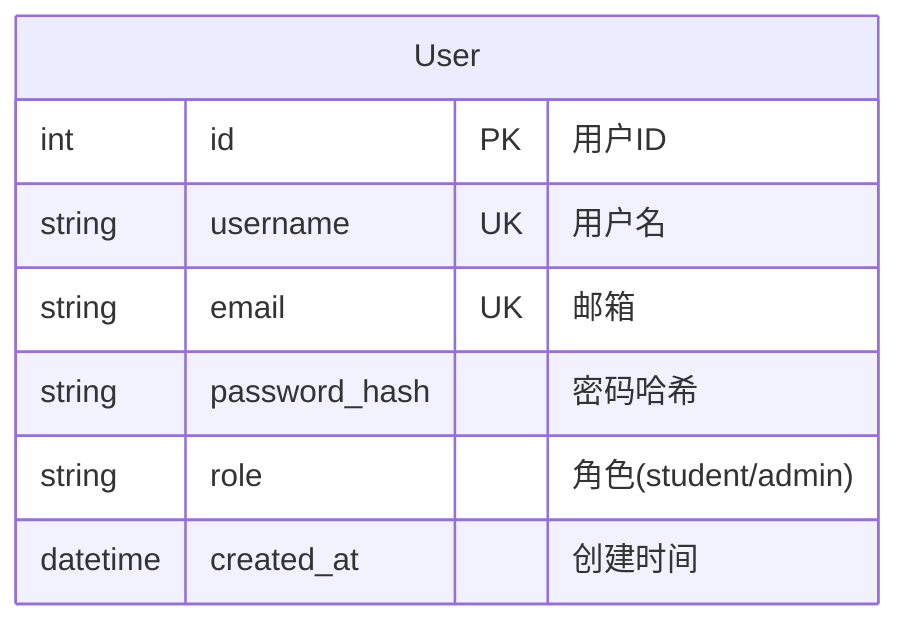

**图3-3 用户实体属性图**

**（2）课程实体属性图**

课程实体包括 ID、课程名称、课程编号、课程描述、授课教师、学分、容量、已选人数、学期、分类ID、上课地点、创建时间等属性。

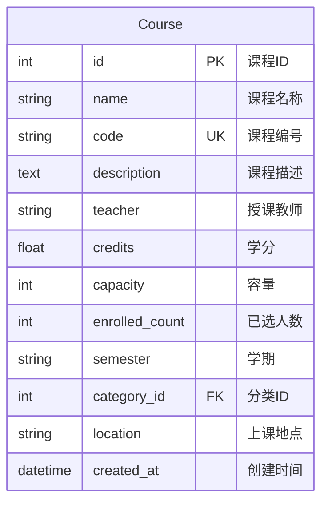

**图3-4 课程实体属性图**

**（3）课程分类实体属性图**

课程分类实体包括 ID、分类名称、显示顺序、创建时间等属性。

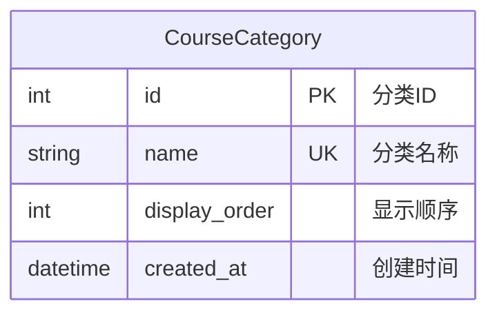

**图3-5 课程分类实体属性图**

**（4）课程时间安排实体属性图**

课程时间安排实体包括 ID、课程ID、星期几、开始时间、结束时间等属性。

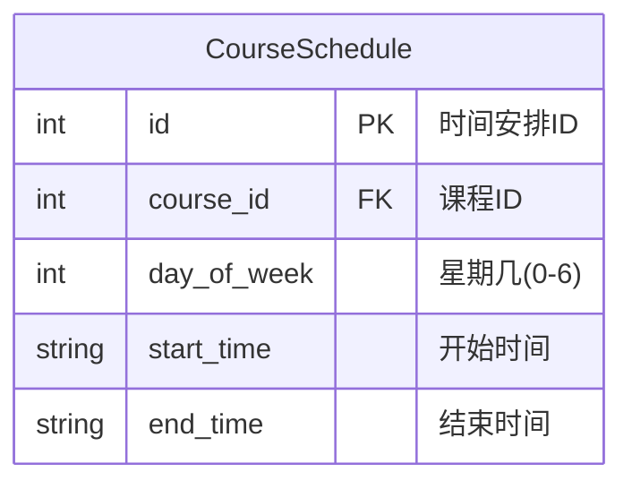

**图3-6 课程时间安排实体属性图**

**（5）选课记录实体属性图**

选课记录实体包括 ID、学生ID、课程ID、状态（enrolled/dropped）、选课时间等属性。

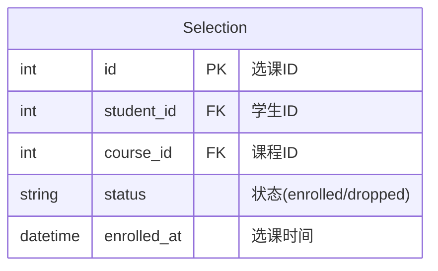

**图3-7 选课记录实体属性图**

**系统 E-R 关系**：

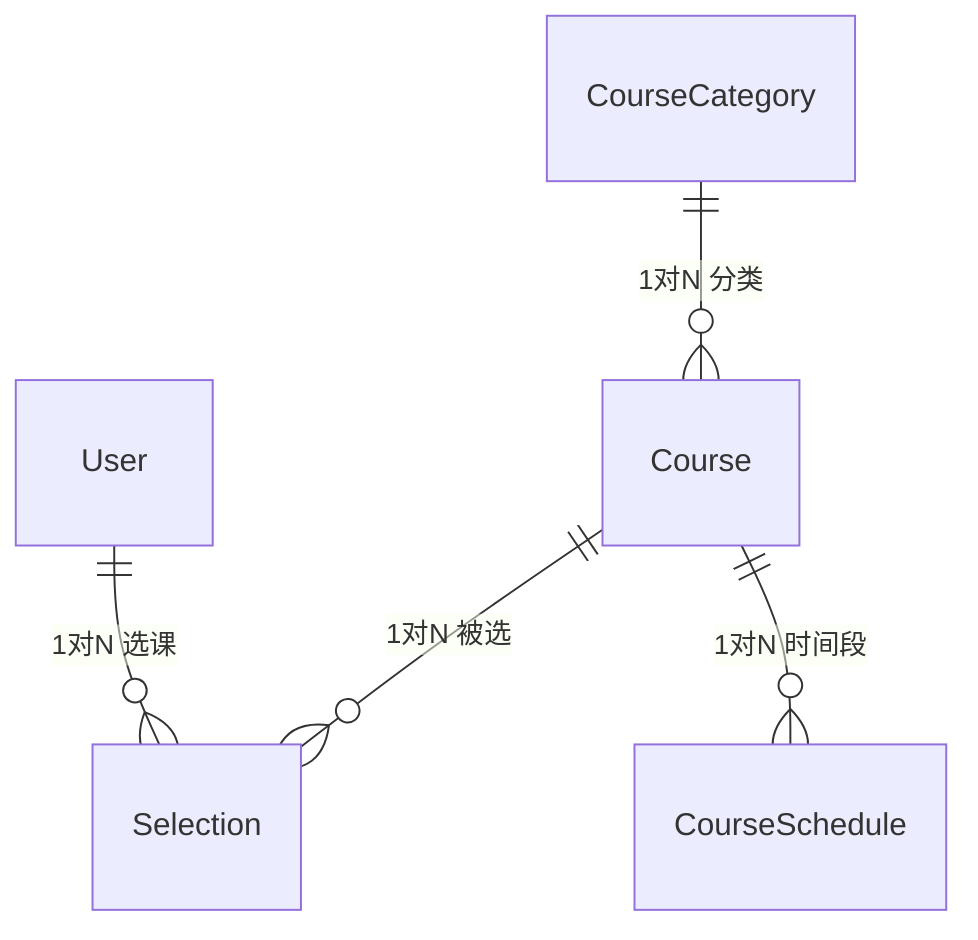

**图3-8 系统E-R图**

- 用户 1:N 选课记录（一个学生可以有多条选课记录）
- 课程 1:N 选课记录（一门课程可以被多个学生选择）
- 课程 1:N 课程时间安排（一门课程可以有多个上课时间段）
- 课程分类 1:N 课程（一个分类下可以有多门课程）

#### 3.3.2 逻辑设计

- 用户（ID，用户名，邮箱，密码哈希，角色，创建时间）
- 课程（ID，课程名称，课程编号，课程描述，授课教师，学分，容量，已选人数，学期，分类ID，上课地点，创建时间）
- 课程分类（ID，分类名称，显示顺序，创建时间）
- 课程时间安排（ID，课程ID，星期几，开始时间，结束时间）
- 选课记录（ID，学生ID，课程ID，状态，选课时间）

#### 3.3.3 数据库表设计

**表3-3 用户表（users）**

| 字段名 | 数据类型 | 主键 | 字段值约束 | 对应中文属性名 |
|--------|---------|------|-----------|---------------|
| id | INTEGER | TRUE | NOT NULL | 用户ID |
| username | VARCHAR(64) | FALSE | NOT NULL, UNIQUE | 用户名 |
| email | VARCHAR(128) | FALSE | NOT NULL, UNIQUE | 邮箱 |
| password_hash | VARCHAR(256) | FALSE | NOT NULL | 密码哈希 |
| role | VARCHAR(16) | FALSE | NOT NULL, DEFAULT 'student' | 角色 |
| created_at | DATETIME | FALSE | NOT NULL | 创建时间 |

**表3-4 课程表（courses）**

| 字段名 | 数据类型 | 主键 | 字段值约束 | 对应中文属性名 |
|--------|---------|------|-----------|---------------|
| id | INTEGER | TRUE | NOT NULL | 课程ID |
| name | VARCHAR(128) | FALSE | NOT NULL | 课程名称 |
| code | VARCHAR(32) | FALSE | NOT NULL, UNIQUE | 课程编号 |
| description | TEXT | FALSE | DEFAULT '' | 课程描述 |
| teacher | VARCHAR(64) | FALSE | NOT NULL | 授课教师 |
| credits | FLOAT | FALSE | NOT NULL, DEFAULT 2.0 | 学分 |
| capacity | INTEGER | FALSE | NOT NULL, DEFAULT 60 | 容量 |
| enrolled_count | INTEGER | FALSE | NOT NULL, DEFAULT 0 | 已选人数 |
| semester | VARCHAR(16) | FALSE | NOT NULL | 学期 |
| category_id | INTEGER | FALSE | FK→course_categories.id | 分类ID |
| location | VARCHAR(128) | FALSE | DEFAULT '' | 上课地点 |
| created_at | DATETIME | FALSE | NOT NULL | 创建时间 |

**表3-5 课程分类表（course_categories）**

| 字段名 | 数据类型 | 主键 | 字段值约束 | 对应中文属性名 |
|--------|---------|------|-----------|---------------|
| id | INTEGER | TRUE | NOT NULL | 分类ID |
| name | VARCHAR(64) | FALSE | NOT NULL, UNIQUE | 分类名称 |
| display_order | INTEGER | FALSE | NOT NULL, DEFAULT 0 | 显示顺序 |
| created_at | DATETIME | FALSE | NOT NULL | 创建时间 |

**表3-6 课程时间安排表（course_schedules）**

| 字段名 | 数据类型 | 主键 | 字段值约束 | 对应中文属性名 |
|--------|---------|------|-----------|---------------|
| id | INTEGER | TRUE | NOT NULL | 时间安排ID |
| course_id | INTEGER | FALSE | NOT NULL, FK→courses.id | 课程ID |
| day_of_week | INTEGER | FALSE | NOT NULL (0=周一…6=周日) | 星期几 |
| start_time | VARCHAR(8) | FALSE | NOT NULL | 开始时间 |
| end_time | VARCHAR(8) | FALSE | NOT NULL | 结束时间 |

**表3-7 选课记录表（selections）**

| 字段名 | 数据类型 | 主键 | 字段值约束 | 对应中文属性名 |
|--------|---------|------|-----------|---------------|
| id | INTEGER | TRUE | NOT NULL | 选课ID |
| student_id | INTEGER | FALSE | NOT NULL, FK→users.id | 学生ID |
| course_id | INTEGER | FALSE | NOT NULL, FK→courses.id | 课程ID |
| status | VARCHAR(16) | FALSE | NOT NULL, DEFAULT 'enrolled' | 状态 |
| enrolled_at | DATETIME | FALSE | NOT NULL | 选课时间 |
| *(唯一约束)* | | | UNIQUE(student_id, course_id) | 一人一课唯一 |

#### 3.3.4 系统类图

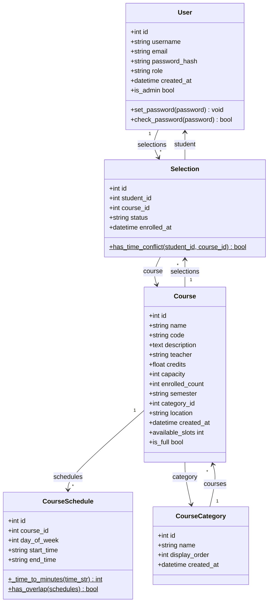

**图3-9 系统类图**

**类设计（Python SQLAlchemy ORM 模型）：**

| 类名 | 属性 | 方法 |
|------|------|------|
| User | id, username, email, password_hash, role, created_at | set_password(), check_password(), is_admin (property) |
| Course | id, name, code, description, teacher, credits, capacity, enrolled_count, semester, category_id, location, created_at | available_slots (property), is_full (property) |
| CourseCategory | id, name, display_order, created_at | — |
| CourseSchedule | id, course_id, day_of_week, start_time, end_time | _time_to_minutes() (static), has_overlap() (classmethod) |
| Selection | id, student_id, course_id, status, enrolled_at | has_time_conflict() (static) |

**类间关系**：
- User 1:N Selection（一个学生可以有多个选课记录）
- Course 1:N Selection（一门课程可以被多个学生选择）
- Course 1:N CourseSchedule（一门课程可以有多个上课时间段）
- CourseCategory 1:N Course（一个分类下可以有多门课程）
- Selection 关联 User（student_id→User.id）和 Course（course_id→Course.id）

### 3.4 设计检查列表

#### 3.4.1 功能设计检查列表

**表3-8 功能设计检查列表**

| 编号 | 功能名称 | 使用角色 | 功能描述 | 输入内容 | 系统响应 | 输出内容 | 是否覆盖 |
|------|---------|---------|---------|---------|---------|---------|---------|
| 1 | 用户注册 | 学生 | 学生进行账号注册 | 用户名、邮箱、密码 | 注册成功/失败提示 | 用户账号信息 | 是 |
| 2 | 用户登录 | 学生/管理员 | 用户登录系统 | 用户名、密码 | 登录成功跳转/失败提示 | 会话信息 | 是 |
| 3 | 课程浏览 | 学生 | 浏览课程列表 | 筛选条件 | 分页展示课程 | 课程卡片列表 | 是 |
| 4 | 课程搜索 | 学生 | 搜索课程 | 关键词 | 匹配课程列表 | 搜索结果 | 是 |
| 5 | 课程详情 | 学生 | 查看课程信息 | 课程ID | 展示课程详情 | 课程完整信息 | 是 |
| 6 | 选课 | 学生 | 选择课程 | 课程ID | 冲突检测+名额检查 | 选课成功/失败 | 是 |
| 7 | 退课 | 学生 | 退选课程 | 课程ID | 退课确认 | 退课成功/失败 | 是 |
| 8 | 课程表 | 学生 | 查看周课表 | — | 渲染可视化课表 | 彩色周课表 | 是 |
| 9 | 已选课程 | 学生 | 查看已选课程 | — | 展示已选列表 | 已选课程列表 | 是 |
| 10 | 课程管理 | 管理员 | 管理课程信息 | 课程数据 | 增删改查操作 | 操作结果 | 是 |
| 11 | 分类管理 | 管理员 | 管理课程分类 | 分类名称 | 增删改操作 | 操作结果 | 是 |
| 12 | 学生管理 | 管理员 | 管理学生信息 | 学生数据 | 查看/编辑操作 | 操作结果 | 是 |
| 13 | 选课管理 | 管理员 | 查看选课记录 | 筛选条件 | 展示选课列表 | 选课记录列表 | 是 |
| 14 | 批量导入 | 管理员 | Excel导入课程 | .xlsx文件 | 解析并导入 | 导入结果反馈 | 是 |
| 15 | 修改密码 | 管理员 | 修改管理员密码 | 新旧密码 | 密码更新 | 操作结果 | 是 |

---

## 第四章 详细设计

### 4.1 模块/组件/算法详细设计

#### 4.1.1 系统核心模块

**1、认证模块**

（1）模块编号：M-001
（2）模块名称：Auth
（3）模块功能：用户注册、登录、登出，Session 管理
（4）模块背景描述：认证模块是整个系统的基础，负责用户身份验证和会话管理。使用 Flask-Login 实现基于 Cookie+Session 的用户认证机制。
（5）模块算法设计：
- 注册流程：验证输入 → 检查用户名/邮箱唯一性 → 密码哈希 → 保存用户 → 重定向登录页
- 登录流程：验证输入 → 查询用户 → 验证密码 → 创建会话 → 按角色跳转
- 登出流程：清除会话 → 重定向首页

（6）模块调用方法：
- 调用方式：用户通过登录/注册页面提交表单
- 入口参数：username, email, password
- 出口参数：会话状态、角色信息
- 异常处理：用户名重复/邮箱重复/密码错误/密码不一致

**2、课程浏览模块**

（1）模块编号：M-002
（2）模块名称：Course List
（3）模块功能：分页展示课程列表，支持多条件筛选和搜索
（4）模块背景描述：课程浏览模块是学生端的核心入口，提供灵活的课程检索功能。支持按学期、分类、关键词进行筛选，支持隐藏已选课程。
（5）模块算法设计：
- 获取筛选参数 → 构建 SQLAlchemy 查询 → 应用过滤条件 → 分页 → 渲染模板
- 学生端额外逻辑：获取已选课程 ID 集合，用于标记已选状态和隐藏已选课程

（6）模块调用方法：
- 调用方式：GET /course/
- 入口参数：page, semester, category, search, hide_enrolled
- 出口参数：课程分页对象、已选课程ID集合、筛选选项

**3、选课模块（核心业务逻辑）**

（1）模块编号：M-003
（2）模块名称：Enrollment
（3）模块功能：选课和退课操作，含时间冲突检测和名额管理
（4）模块背景描述：选课模块是整个系统的核心业务逻辑。选课时需要同时检查课程名额和时间冲突，确保选课操作的合法性和数据一致性。
（5）模块算法设计 —— **选课冲突检测算法**：

```
算法：选课时间冲突检测
输入：student_id, course_id
输出：has_conflict (bool)

步骤：
1. 查询目标课程的所有时间段（target_schedules）
2. 如果目标课程无时间段，返回无冲突
3. 查询学生所有已选课程的时间段（enrolled_schedules）
4. 对于目标课程的每个时间段 target：
   a. 对于已选课程的每个时间段 enrolled：
      - 如果 target.day_of_week == enrolled.day_of_week：
        - 如果 target.start_time < enrolled.end_time 且 target.end_time > enrolled.start_time：
          - 返回有冲突
5. 返回无冲突
```

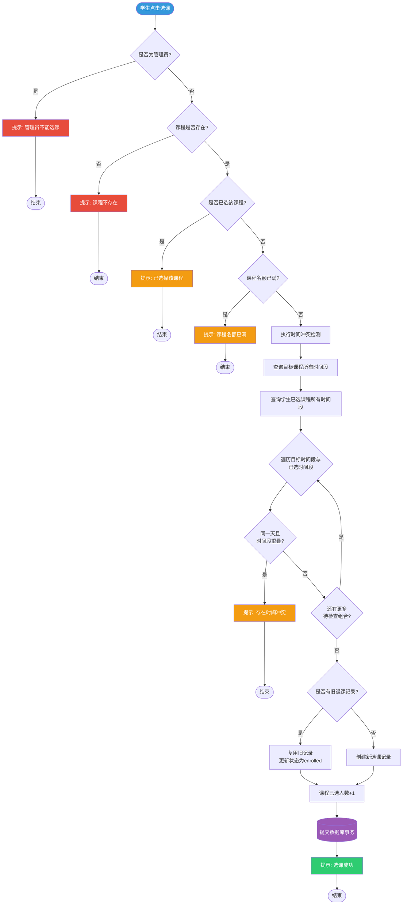

**图4-1 选课冲突检测活动图**

（6）模块调用方法：
- 选课：POST /course/<id>/enroll
- 退课：POST /course/<id>/drop
- 异常处理：课程不存在、管理员不能选课、已选课程、名额已满、时间冲突

**4、课表模块**

（1）模块编号：M-004
（2）模块名称：Timetable
（3）模块功能：以可视化表格展示学生一周课程安排
（4）模块背景描述：课表模块以 7（天）× N（时间段）的表格形式展示学生的课程安排，使用 17 种颜色循环为不同课程着色，直观显示课程时间分布。
（5）模块算法设计：
- 获取学生已选课程及时间安排 → 构建星期×时间段矩阵 → 按颜色循环染色 → 渲染课表页面

**5、管理员课程管理模块**

（1）模块编号：M-005
（2）模块名称：Admin Course Management
（3）模块功能：课程的增删改查，支持多时间段排课
（4）模块背景描述：管理员可以创建、编辑、查看和删除课程。课程支持多时间段排课（如周一 8:00-9:40 + 周三 10:00-11:40）。时间段数据通过 JSON 序列化在前端与后端之间传递。
（5）模块调用方法：
- 入口参数：课程名称、编号、教师、学分、容量、学期、分类、地点、描述、时间段 JSON
- 出口参数：操作结果

#### 4.1.2 核心功能模块详细设计

**1、课程搜索与筛选模块**

（1）模块编号：M-002-1
（2）模块名称：Course Search & Filter
（3）模块功能：提供学期筛选、分类筛选、关键词搜索和隐藏已选课程四个维度的课程过滤
（4）模块算法设计：
- 学期筛选：WHERE semester = 参数
- 分类筛选：WHERE category_id = 参数
- 关键词搜索：WHERE name LIKE 参数 OR code LIKE 参数 OR teacher LIKE 参数
- 隐藏已选：WHERE id NOT IN (已选课程ID集合)

这些过滤条件可以任意组合，形成联合查询。

**2、Excel 批量导入模块**

（1）模块编号：M-005-1
（2）模块名称：Course Import
（3）模块功能：通过上传 .xlsx 文件批量导入课程数据
（4）模块算法设计：
- 接收上传文件 → 使用 openpyxl 解析 → 逐行验证数据 → 批量创建 Course 对象 → 提交数据库
- 数据验证包括：必填字段检查、格式验证、唯一性检查、时间段格式验证
- 支持 CSV 和 Excel (.xlsx) 两种格式

### 4.2 接口实现设计

**1、选课接口（核心 API）**

（1）接口中文名称：校园网上选课系统选课接口
（2）接口英文名称：Course Enrollment API for University Online Course Selection System
（3）接口内容与功能：该接口处理学生的选课请求，在选课前自动执行名额检查和冲突检测，确保选课操作的合法性和数据完整性。
（4）接口的传输协议：HTTPS
（5）接口程序的伪代码：

```
def enroll(course_id):
    # 1. 验证用户身份（学生角色）
    if current_user.is_admin:
        return "管理员不能选课"
    
    # 2. 查询课程
    course = get_course_by_id(course_id)
    if course is None:
        return "课程不存在"
    
    # 3. 检查是否已选
    existing = get_selection(student_id, course_id)
    if existing and existing.status == "enrolled":
        return "已选择该课程"
    
    # 4. 检查名额
    if course.is_full and (not existing or existing.status != "enrolled"):
        return "课程名额已满"
    
    # 5. 检查时间冲突
    if has_time_conflict(student_id, course_id):
        return "存在时间冲突"
    
    # 6. 执行选课
    if existing:
        existing.status = "enrolled"
        existing.enrolled_at = now()
    else:
        create_selection(student_id, course_id)
    
    course.enrolled_count += 1
    save_changes()
    return "选课成功"
```

**2、时间冲突检测接口**

（1）接口中文名称：课程时间冲突检测接口
（2）接口英文名称：Course Time Conflict Detection API
（3）接口内容与功能：检测学生在所选课程之间是否存在时间冲突。通过比较课程时间段的星期和时间重叠来判断。
（4）接口程序的伪代码：

```
def has_time_conflict(student_id, course_id):
    # 获取目标课程的时间段
    target_schedules = get_schedules(course_id)
    if not target_schedules:
        return False
    
    # 获取学生已选课程的时间段
    enrolled_schedules = get_enrolled_schedules(student_id)
    
    # 两两比较检测重叠
    for target in target_schedules:
        for enrolled in enrolled_schedules:
            if target.day == enrolled.day:
                if target.start < enrolled.end and target.end > enrolled.start:
                    return True
    return False
```

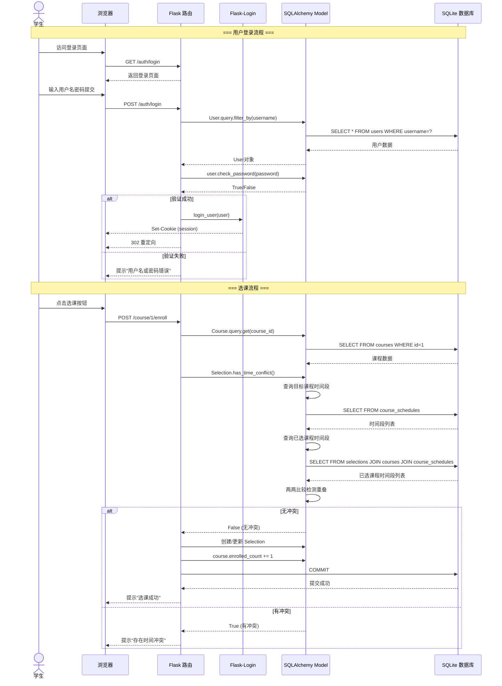

**图4-2 认证与选课时序图**

---

## 第五章 系统实现

### 5.1 开发环境

#### 5.1.1 硬件

- 开发机：Windows 笔记本电脑（16GB RAM）
- 服务器：本地开发环境（localhost）

#### 5.1.2 编程语言和平台

- **后端**：Python 3.x、Flask 3.1.0
- **前端**：HTML5、CSS3、JavaScript（原生）、Jinja2 模板引擎
- **数据库**：SQLite（开发/测试环境）
- **ORM**：SQLAlchemy（Flask-SQLAlchemy）
- **认证**：Flask-Login（Session + Cookie）
- **表单**：WTForms（Flask-WTF），含 CSRF 保护
- **数据库迁移**：Flask-Migrate（Alembic）
- **Excel 处理**：openpyxl
- **测试框架**：pytest + pytest-cov

#### 5.1.3 支持软件

- **IDE**：Visual Studio Code
- **版本控制**：Git
- **Python 包管理**：pip
- **浏览器**：Chrome / Edge

### 5.2 系统程序结构

系统采用 Flask App Factory 模式组织，目录结构如下：

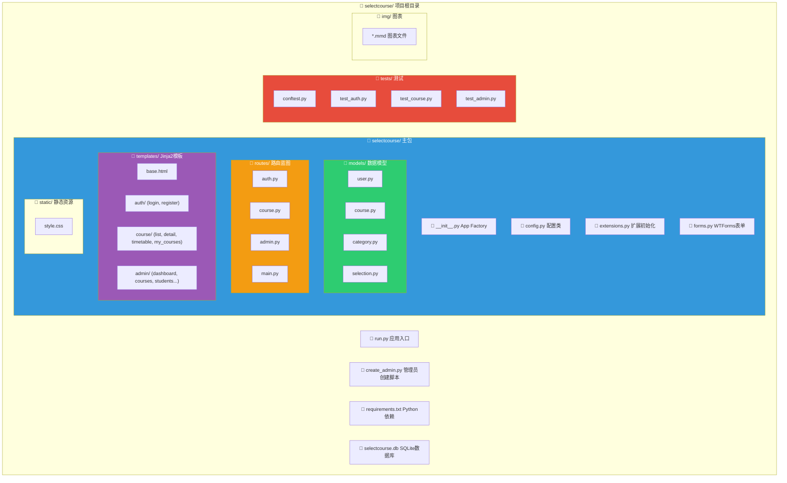

**图5-1 系统目录结构图**

```
selectcourse/
├── run.py                          # 应用入口
├── create_admin.py                 # 管理员创建脚本
├── requirements.txt                # Python 依赖
├── selectcourse/                   # 主包
│   ├── __init__.py                 # App Factory (create_app)
│   ├── config.py                   # 配置类 (Config, TestingConfig)
│   ├── extensions.py               # Flask 扩展初始化
│   ├── forms.py                    # WTForms 表单定义
│   ├── models/                     # 数据模型
│   │   ├── __init__.py
│   │   ├── user.py                 # User 模型
│   │   ├── course.py               # Course + CourseSchedule 模型
│   │   ├── category.py             # CourseCategory 模型
│   │   └── selection.py            # Selection 模型
│   ├── routes/                     # 路由蓝图
│   │   ├── __init__.py
│   │   ├── auth.py                 # 认证路由 (/auth)
│   │   ├── course.py               # 课程路由 (/course)
│   │   ├── admin.py                # 管理员路由 (/admin)
│   │   └── main.py                 # 主页路由 (/)
│   ├── static/
│   │   └── style.css               # 全局样式
│   └── templates/                  # Jinja2 模板
│       ├── base.html               # 基础布局模板
│       ├── index.html              # 首页
│       ├── auth/
│       │   ├── login.html          # 登录页
│       │   └── register.html       # 注册页
│       ├── course/
│       │   ├── list.html           # 课程列表页
│       │   ├── detail.html         # 课程详情页
│       │   ├── my_courses.html     # 我的选课页
│       │   └── timetable.html      # 课程表页
│       └── admin/
│           ├── dashboard.html      # 管理后台首页
│           ├── courses.html        # 课程管理列表
│           ├── create_course.html  # 新建课程
│           ├── edit_course.html    # 编辑课程
│           ├── categories.html     # 分类管理
│           ├── students.html       # 学生列表
│           ├── student_detail.html # 学生选课详情
│           ├── edit_student.html   # 编辑学生
│           ├── selections.html     # 选课记录
│           ├── import_courses.html # 批量导入
│           └── change_password.html# 修改密码
└── tests/                          # 测试
    ├── __init__.py
    ├── conftest.py                 # 测试配置与 fixtures
    ├── test_auth.py                # 认证模块测试
    ├── test_course.py              # 课程与选课测试
    └── test_admin.py               # 管理员模块测试
```

### 5.3 系统模块实现

#### 5.3.1 认证模块实现

**一、操作流程**

1. **登录**：用户输入用户名和密码进行登录。系统通过 SQLAlchemy 查询用户，使用 Werkzeug 的 `check_password_hash()` 验证密码。验证成功后，使用 Flask-Login 的 `login_user()` 创建会话，并根据角色重定向（学生 → 课程列表，管理员 → 管理后台）。

2. **注册**：用户填写用户名、邮箱、密码和确认密码。系统验证密码一致性、长度和邮箱格式，检查用户名和邮箱唯一性。通过后对密码进行 bcrypt 哈希加密，创建 User 对象并保存。

3. **登出**：调用 Flask-Login 的 `logout_user()` 清除用户会话。

**二、关键页面说明**

1. **登录页面（login.html）**：提供用户名和密码输入框，以及登录按钮和注册链接。
2. **注册页面（register.html）**：提供用户名、邮箱、密码和确认密码输入框，以及注册按钮。

**三、关键代码**

1. 密码加密与验证（User 模型）：
```python
def set_password(self, password: str) -> None:
    self.password_hash = generate_password_hash(password)

def check_password(self, password: str) -> bool:
    return check_password_hash(self.password_hash, password)
```

2. 登录处理（auth.py）：
```python
user = User.query.filter_by(username=form.username.data).first()
if user is None or not user.check_password(form.password.data):
    flash("用户名或密码错误。", "danger")
    return render_template("auth/login.html", form=form)
login_user(user, remember=True)
```

3. 权限控制装饰器（admin.py）：
```python
def admin_required(f):
    @wraps(f)
    @login_required
    def decorated(*args, **kwargs):
        if not current_user.is_admin:
            flash("需要管理员权限。", "danger")
            return redirect(url_for("main.index"))
        return f(*args, **kwargs)
    return decorated
```

#### 5.3.2 课程浏览模块实现

**一、操作流程**

1. **课程列表**：学生登录后进入课程列表，系统分页展示所有课程。每门课程以卡片形式展示课程名称、编号、教师、学分、容量/已选人数、时间段、分类等核心信息。

2. **筛选与搜索**：学生可按学期下拉选择、分类下拉选择、关键词搜索和"隐藏已选课程"复选框进行多维度筛选。

3. **课程详情**：点击课程卡片上的"详情"按钮，弹出 Modal 弹窗显示课程完整信息（通过 API 异步加载 JSON 数据），包括课程描述、上课时间安排、上课地点等。

**二、关键页面说明**

1. **课程列表页面（list.html）**：使用卡片网格布局展示课程，顶部有筛选工具栏。
2. **课程详情弹窗**：使用原生 JavaScript 实现的 Modal 弹窗，通过 fetch API 加载课程详情 JSON。

**三、关键代码（course.py）**

```python
@course_bp.route("/")
@login_required
def list_courses():
    # 获取筛选参数
    page = request.args.get("page", 1, type=int)
    semester = request.args.get("semester", "")
    search = request.args.get("search", "")
    category = request.args.get("category", "")
    hide_enrolled = request.args.get("hide_enrolled", "0") == "1"
    
    # 构建查询
    query = Course.query
    if semester:
        query = query.filter(Course.semester == semester)
    if category:
        query = query.filter(Course.category_id == int(category))
    if search:
        query = query.filter(db.or_(
            Course.name.contains(search),
            Course.code.contains(search),
            Course.teacher.contains(search),
        ))
    
    # 分页
    pagination = query.order_by(Course.code).paginate(
        page=page, per_page=12, error_out=False
    )
    return render_template("course/list.html", ...)
```

#### 5.3.3 选课模块实现

**一、操作流程**

1. **选课**：学生在课程列表或详情页点击"选课"按钮，系统依次检查：是否为管理员→是否已选→名额是否已满→是否存在时间冲突。全部通过后创建选课记录，更新课程已选人数。

2. **退课**：学生在"已选课程"页面点击"退课"按钮，系统将选课状态更新为 dropped，减少课程已选人数。

**二、关键代码**

```python
@course_bp.route("/<int:course_id>/enroll", methods=["POST"])
@login_required
def enroll(course_id: int):
    # ... 验证与检查 ...
    
    # 检查时间冲突
    if Selection.has_time_conflict(current_user.id, course_id):
        flash("与已选课程存在时间冲突，无法选课。", "danger")
        return redirect(url_for("course.detail", course_id=course_id))
    
    # 执行选课
    if existing:
        existing.status = "enrolled"
        existing.enrolled_at = datetime.now(BEIJING_TZ)
    else:
        existing = Selection(student_id=current_user.id, course_id=course_id)
        db.session.add(existing)
    course.enrolled_count += 1
    db.session.commit()
```

#### 5.3.4 课表模块实现

**一、操作流程**

学生点击"课程表"菜单，系统查询学生所有已选课程及其时间安排，构建 7（天）× N（时间段）的矩阵，以颜色区分不同课程，渲染可视化课表。

**二、关键算法**

课表颜色分配：使用预定义的 17 种颜色数组，按课程顺序循环分配，确保相邻课程颜色不同。

```python
TIMETABLE_COLORS = [
    "#E74C3C", "#3498DB", "#2ECC71", "#9B59B6", "#F39C12",
    "#1ABC9C", "#E67E22", "#2980B9", "#27AE60", "#8E44AD",
    "#D35400", "#16A085", "#C0392B", "#2C3E50", "#7F8C8D",
    "#F1C40F", "#00B894",
]
```

#### 5.3.5 管理员模块实现

**一、操作流程**

1. **系统概览**：展示学生总数、课程总数、选课记录数等统计信息。

2. **课程管理**：支持课程的新建（含多时间段排课）、编辑、查看详情和删除。

3. **分类管理**：支持课程分类的添加、编辑和删除，默认包含"通识课程"、"必修课程"、"体育分项"和"其他"四个分类。

4. **学生管理**：查看学生列表、查看学生选课详情、编辑学生信息。

5. **选课管理**：查看所有选课记录，支持按学号、课程等条件筛选。

6. **批量导入**：支持上传 Excel（.xlsx）或 CSV 文件批量导入课程数据。

7. **修改密码**：管理员修改自己的登录密码。

### 5.4 程序文件和数据文件一览表

**表5-1 文件一览表**

| 序号 | 文件名称 | 文件类型 |
|------|----------|----------|
| 1 | run.py | 程序文件（应用入口） |
| 2 | create_admin.py | 程序文件（管理员创建脚本） |
| 3 | selectcourse/__init__.py | 程序文件（App Factory） |
| 4 | selectcourse/config.py | 程序文件（配置类） |
| 5 | selectcourse/extensions.py | 程序文件（扩展初始化） |
| 6 | selectcourse/forms.py | 程序文件（表单定义） |
| 7 | selectcourse/models/user.py | 程序文件（用户模型） |
| 8 | selectcourse/models/course.py | 程序文件（课程模型） |
| 9 | selectcourse/models/category.py | 程序文件（分类模型） |
| 10 | selectcourse/models/selection.py | 程序文件（选课模型） |
| 11 | selectcourse/routes/auth.py | 程序文件（认证路由） |
| 12 | selectcourse/routes/course.py | 程序文件（课程路由） |
| 13 | selectcourse/routes/admin.py | 程序文件（管理员路由） |
| 14 | selectcourse/routes/main.py | 程序文件（主页路由） |
| 15 | selectcourse/static/style.css | 样式文件 |
| 16 | selectcourse/templates/base.html | 模板文件 |
| 17 | selectcourse/templates/index.html | 模板文件 |
| 18 | selectcourse/templates/auth/login.html | 模板文件 |
| 19 | selectcourse/templates/auth/register.html | 模板文件 |
| 20 | selectcourse/templates/course/list.html | 模板文件 |
| 21 | selectcourse/templates/course/detail.html | 模板文件 |
| 22 | selectcourse/templates/course/my_courses.html | 模板文件 |
| 23 | selectcourse/templates/course/timetable.html | 模板文件 |
| 24 | selectcourse/templates/admin/dashboard.html | 模板文件 |
| 25 | selectcourse/templates/admin/courses.html | 模板文件 |
| 26 | selectcourse/templates/admin/create_course.html | 模板文件 |
| 27 | selectcourse/templates/admin/edit_course.html | 模板文件 |
| 28 | selectcourse/templates/admin/categories.html | 模板文件 |
| 29 | selectcourse/templates/admin/students.html | 模板文件 |
| 30 | selectcourse/templates/admin/student_detail.html | 模板文件 |
| 31 | selectcourse/templates/admin/edit_student.html | 模板文件 |
| 32 | selectcourse/templates/admin/selections.html | 模板文件 |
| 33 | selectcourse/templates/admin/import_courses.html | 模板文件 |
| 34 | selectcourse/templates/admin/change_password.html | 模板文件 |
| 35 | tests/conftest.py | 测试文件 |
| 36 | tests/test_auth.py | 测试文件 |
| 37 | tests/test_course.py | 测试文件 |
| 38 | tests/test_admin.py | 测试文件 |
| 39 | requirements.txt | 配置文件 |
| 40 | selectcourse.db | 数据文件（SQLite） |

### 5.5 系统部署架构

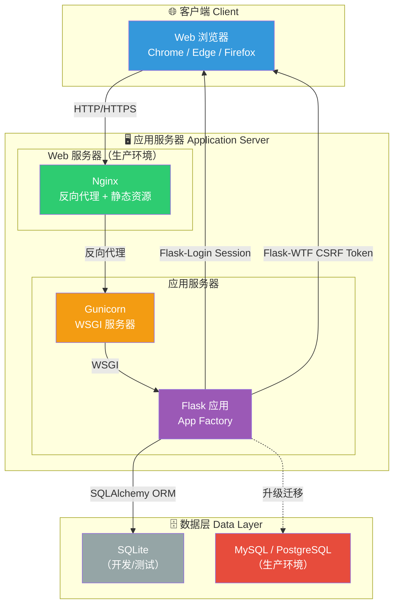

**图5-2 系统部署架构图**

---

## 第六章 系统测试

### 6.1 测试环境要求

- **开发环境**：Windows 10 操作系统，16GB RAM
- **浏览器**：Chrome/Edge 最新版
- **Python 版本**：Python 3.x
- **测试框架**：pytest 8.3.4 + pytest-cov 6.0.0
- **测试数据库**：SQLite 内存数据库（TestingConfig 配置）
- **测试 IDE**：Visual Studio Code

### 6.2 测试计划

本系统采用自动化测试为主、手工测试为辅的测试策略。使用 pytest 框架编写单元测试和集成测试，覆盖认证模块、课程模块和管理员模块的所有核心功能。

**测试范围**：
- 认证模块：注册、登录、权限验证
- 课程浏览模块：列表展示、筛选、搜索、分页
- 选课模块：选课、退课、冲突检测、名额检查
- 课表模块：课表展示
- 管理员模块：课程管理、分类管理、学生管理、批量导入

**测试方法**：
- 使用 pytest fixtures 提供测试客户端、数据库会话和测试用户
- 使用 TestingConfig 配置 SQLite 内存数据库
- 测试覆盖正常流程和异常情况（边界值、错误输入、权限验证）

### 6.3 功能测试报告

#### 6.3.1 学生模块功能测试报告

**表6-1 学生功能点功能测试记录**

| 编号 | 测试项目 | 前置条件 | 输入 | 预期输出结果 | 实际输出 | 测试结果 |
|------|----------|----------|------|-------------|----------|----------|
| 1-1 | 用户注册 | 无 | 符合条件的数据 | 注册成功 | 注册成功 | √ |
| 1-2 | 用户注册 | 无 | 已存在的用户名 | 提示已被使用 | 提示已被使用 | √ |
| 1-3 | 用户注册 | 无 | 已存在的邮箱 | 提示已被注册 | 提示已被注册 | √ |
| 1-4 | 用户注册 | 无 | 密码少于6位 | 提示至少6位 | 提示至少6位 | √ |
| 1-5 | 用户注册 | 无 | 两次密码不一致 | 提示不一致 | 提示不一致 | √ |
| 1-6 | 用户登录 | 已注册 | 正确的用户名密码 | 登录成功 | 登录成功 | √ |
| 1-7 | 用户登录 | 已注册 | 错误的密码 | 用户名或密码错误 | 提示错误 | √ |
| 1-8 | 课程列表 | 已登录学生 | 访问课程列表 | 展示课程列表 | 展示课程列表 | √ |
| 1-9 | 课程搜索 | 已登录学生 | 输入关键词 | 匹配课程 | 搜索结果正确 | √ |
| 1-10 | 学期筛选 | 已登录学生 | 选择学期 | 筛选课程 | 筛选结果正确 | √ |
| 1-11 | 分类筛选 | 已登录学生 | 选择分类 | 筛选课程 | 筛选结果正确 | √ |
| 1-12 | 隐藏已选 | 已登录学生 | 勾选隐藏 | 隐藏已选课程 | 已选课程被隐藏 | √ |
| 1-13 | 课程详情 | 已登录学生 | 点击课程 | 展示课程信息 | 展示课程完整信息 | √ |
| 1-14 | 选课 | 已登录学生 | 点击选课 | 选课成功 | 选课成功 | √ |
| 1-15 | 选课-名额已满 | 课程容量已满 | 点击选课 | 提示名额已满 | 提示名额已满 | √ |
| 1-16 | 选课-时间冲突 | 已选冲突课程 | 点击选课 | 提示时间冲突 | 提示时间冲突 | √ |
| 1-17 | 选课-重复选课 | 已选该课程 | 点击选课 | 提示已选 | 提示已选 | √ |
| 1-18 | 退课 | 已选课程 | 点击退课 | 退课成功 | 退课成功 | √ |
| 1-19 | 课程表 | 已选课程 | 查看课程表 | 展示课表 | 展示彩色课表 | √ |
| 1-20 | 已选课程 | 已选课程 | 查看已选 | 展示已选列表 | 展示已选列表 | √ |
| 1-21 | 管理员不能选课 | 管理员登录 | 尝试选课 | 提示管理员不能选课 | 提示管理员不能选课 | √ |
| 1-22 | 未登录访问 | 未登录 | 访问课程列表 | 重定向登录页 | 重定向登录页 | √ |

#### 6.3.2 管理员模块功能测试报告

**表6-2 管理员功能点功能测试记录**

| 编号 | 测试项目 | 前置条件 | 输入 | 预期输出结果 | 实际输出 | 测试结果 |
|------|----------|----------|------|-------------|----------|----------|
| 2-1 | 管理员登录 | 管理员账号 | 正确密码 | 登录成功，进入后台 | 登录成功 | √ |
| 2-2 | 系统概览 | 管理员登录 | 访问后台 | 展示统计数据 | 展示统计 | √ |
| 2-3 | 新建课程 | 管理员登录 | 课程信息 | 创建成功 | 创建成功 | √ |
| 2-4 | 新建课程-编号重复 | 管理员登录 | 重复编号 | 提示编号已存在 | 提示已存在 | √ |
| 2-5 | 编辑课程 | 管理员登录 | 修改信息 | 更新成功 | 更新成功 | √ |
| 2-6 | 删除课程 | 管理员登录 | 删除课程 | 删除成功 | 删除成功 | √ |
| 2-7 | 查看课程详情 | 管理员登录 | 查看课程 | 展示详情 JSON | 展示详情 | √ |
| 2-8 | 添加分类 | 管理员登录 | 分类名称 | 添加成功 | 添加成功 | √ |
| 2-9 | 编辑分类 | 管理员登录 | 修改名称 | 更新成功 | 更新成功 | √ |
| 2-10 | 删除分类 | 管理员登录 | 删除分类 | 删除成功 | 删除成功 | √ |
| 2-11 | 学生列表 | 管理员登录 | 访问学生管理 | 展示学生列表 | 展示列表 | √ |
| 2-12 | 学生详情 | 管理员登录 | 查看学生 | 展示选课详情 | 展示详情 | √ |
| 2-13 | 编辑学生 | 管理员登录 | 修改信息 | 更新成功 | 更新成功 | √ |
| 2-14 | 选课记录 | 管理员登录 | 查看选课记录 | 展示记录列表 | 展示列表 | √ |
| 2-15 | 批量导入 | 管理员登录 | 上传 Excel | 导入成功 | 导入成功 | √ |
| 2-16 | 修改密码 | 管理员登录 | 新密码 | 修改成功 | 修改成功 | √ |
| 2-17 | 学生访问后台 | 学生登录 | 访问 /admin/ | 提示需要管理员权限 | 提示权限不足 | √ |

### 6.4 测试结论

- **测试类别**：自动化单元测试 + 集成测试 + 手工功能测试
- **测试完成日期**：2026年7月29日
- **测试环境**：VS Code + pytest + SQLite 内存数据库
- **测试框架**：pytest 8.3.4 + pytest-cov 6.0.0
- **测试覆盖率**：目标 ≥ 80% 行覆盖率
- **测试结果**：核心功能测试全部通过，系统运行稳定，未发现严重缺陷。

---

## 第七章 总结与展望

### 7.1 团队分工与完成情况

| 成员 | 姓名 | 班级 | 学号 | 完成情况 | 贡献度 |
|------|------|------|------|----------|--------|
| 组长 |  |  |  | 100% | 100% |

**角色分工**：
- 系统需求分析
- 系统概要设计
- 系统详细设计
- 系统编码实现（全栈开发）
- 系统测试
- 文档撰写

### 7.2 团队组织协调解决的问题情况与总结

在校园网上选课系统的开发过程中，作为个人独立开发项目，需要在需求分析、系统设计、编码实现和测试等各个环节中保持高度自律和严谨的态度。

技术选型方面，选择了 Python Flask 全栈方案而非传统的 Java Spring Boot + Vue.js 方案。Flask 的轻量和灵活性使得个人开发效率大大提高，同时其完善的扩展生态（Flask-Login、Flask-SQLAlchemy、Flask-WTF 等）能够满足系统的所有功能需求。

数据库设计方面，充分考虑了系统的实际需求，设计了 5 张核心表（用户、课程、课程分类、课程时间安排、选课记录），并通过外键和唯一约束确保数据完整性。使用 SQLAlchemy ORM 简化了数据库操作，Flask-Migrate 为后续数据库升级提供了保障。

安全性方面，实现了完整的 Web 安全防护体系：密码 bcrypt 哈希存储、CSRF 令牌保护、XSS 输出转义、SQL 注入防护（ORM 参数化查询）、基于角色的访问控制（RBAC）。这些措施共同保障了系统的安全性。

测试方面，使用 pytest 框架编写了全面的自动化测试，覆盖认证、课程浏览、选课、管理员功能等核心模块。通过 pytest-cov 监控测试覆盖率，确保代码质量。

### 7.3 项目总结

在校园网上选课系统的开发过程中，从项目最初的构思到最终的实现，完整经历了软件工程的各个环节。

项目伊始，深入分析了高校选课的实际需求和痛点，明确了系统的核心功能：课程浏览与搜索、智能选课（含冲突检测）、可视化课表和管理后台。在系统设计阶段，采用了经典的 MVC 架构模式，以 Flask Blueprint 进行模块化组织，确保代码结构清晰、易于维护。

技术实现过程中，遇到并解决了多个关键技术问题：

1. **时间冲突检测算法**：设计了基于时间段重叠判断的冲突检测算法，通过比较课程在相同星期的时间段是否有重叠来判断冲突。

2. **选课名额的并发控制**：通过原子性的数据库操作和事务管理，确保选课名额更新的数据一致性。

3. **多时间段排课**：设计了灵活的多时间段排课机制，每门课程可以配置多个上课时间段，前端通过 JSON 与后端交互。

4. **Excel 批量导入**：使用 openpyxl 库实现 Excel 文件的解析和批量课程数据导入，降低了管理员的数据录入工作量。

回顾整个项目，深刻体会到软件工程方法论在实际开发中的重要指导作用，以及测试驱动开发对代码质量的保障作用。

### 7.4 收获与未来展望

通过校园网上选课系统的开发，收获了丰富的全栈 Web 开发经验和软件开发流程的实践经验。

技术上，深入掌握了 Flask 框架及其生态系统，包括路由设计、模板渲染、ORM 数据操作、表单验证、CSRF 防护、用户认证等核心技术。同时，熟练掌握了 pytest 自动化测试的编写技巧，理解了测试驱动开发的价值。

工程能力上，体验了从需求分析、系统设计到编码实现、测试验证的完整软件开发生命周期，加深了对软件工程方法论的理解。

展望未来，校园网上选课系统还有以下改进方向：

1. **功能扩展**：增加课程先修条件检查、培养方案学分统计、选课意向调查等功能。
2. **性能优化**：升级数据库为 MySQL/PostgreSQL，增加 Redis 缓存，提升并发处理能力。
3. **数据分析**：引入选课数据分析和可视化，为教务管理决策提供数据支撑。
4. **通知系统**：增加选课结果通知（邮件/站内信）、选课提醒等功能。
5. **移动端优化**：进一步完善响应式设计，或开发微信小程序端。
6. **AI 推荐**：基于学生历史选课数据和专业培养方案，提供个性化的课程推荐。

相信在不断优化和迭代下，校园网上选课系统将成为高校教务管理体系中不可或缺的重要组成部分。

---

## 参考文献

[1] Flask Web 开发：基于 Python 的 Web 应用开发实战（第2版）, Miguel Grinberg, 人民邮电出版社, 2018

[2] SQLAlchemy 官方文档, https://docs.sqlalchemy.org/

[3] Flask 官方文档, https://flask.palletsprojects.com/

[4] Flask-Login 官方文档, https://flask-login.readthedocs.io/

[5] WTForms 官方文档, https://wtforms.readthedocs.io/

[6] pytest 官方文档, https://docs.pytest.org/

[7] 软件工程——实践者的研究方法（第9版）, Roger S. Pressman, 机械工业出版社, 2021

[8] 基于 Flask 的高校选课系统的设计与实现, 计算机与现代化, 2023

[9] Web 应用安全最佳实践, OWASP Top 10, https://owasp.org/www-project-top-ten/
